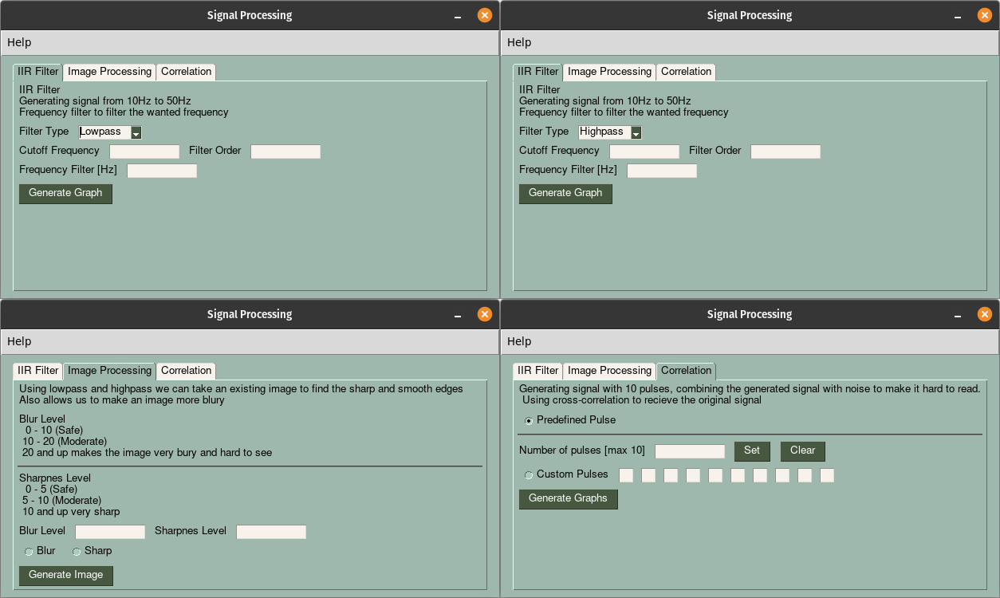

### Signal Processing

Signal Processing is a python program for a university project that uses signal processing to achieve different things. Scipy library is used to analyze the signals.



##### Main features of the program:

- IIR Filter [Lowpass & Highpass]

- Image Processing with Lowpass & Highpass

- Correlation

###### Required Libraries

```
pip install -r requirements.txt
```

or

```
pip install PySimpleGUI
pip install scipy
pip install matplotlib
pip install numpy
```
